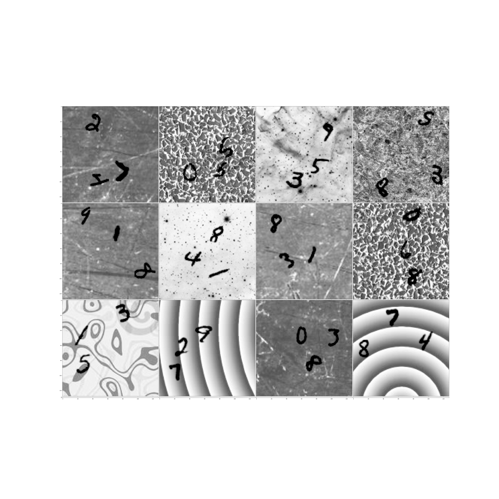
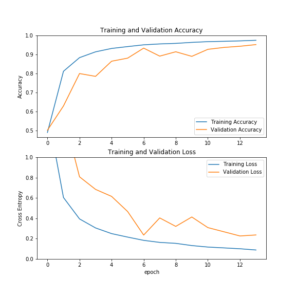

# Mini-Project 3: MiniProject 3: Modified MNIST
- **Goal**: Detect numerically largest digit in the image.  

## Our paper: 
- https://www.overleaf.com/5792449574grsgjxdvsbfw

## Announcements: 
- Our group on MyCourses is **Group 9**, please join ASAP 
- Once the above is done, please join the Kaggle competition on **Group 9**
- If we collect sources along the way, please make sure you write document them down in the **literature** folder.
- As possible,use **branching** whenever
- When a task is done, please put **done** next to it, but please don't delete the whole task until 2 days later so we can all know how progress is going. 
- We will use **Google Colab** to train our models. Notw you can have two notebooks open at the same time. 
- **Models to try**: 
  - Xception 
  - VGG16 
  - InceptionV3
  - InceptionResNetV2	 
  - MobileNetV2
  - DenseNet201
  - NASNetLarge
  - ResNet152V2

## Tasks: 

## All 
- Please go through each of the folders of the repo and read the respective README. 
- *Transfer learning tutorial:* https://tfhub.dev/s?module-type=image-augmentation,image-classification,image-others,image-style-transfer,image-rnn-agent 
- Notebook example for training a model **without** pre-trained parameters (1 colour channel) :

https://colab.research.google.com/drive/1EYHRqa4ycRHq6wYMmf4s_JU9qlfFiKNM

- Notebook example for training a model **with** pre-trained parameters (3 colour channels adjustment)

https://colab.research.google.com/drive/1VTlc6qD0zXHD8g_eOK9_Dy-chfECZC8k 

- *Keras Applications* where you can find all the models to try: 

https://colab.research.google.com/drive/1VTlc6qD0zXHD8g_eOK9_Dy-chfECZC8k

### Jair: 
- Implement Resnet50V2 with pre-trained parameters. 
- Start writing the project report. 

## Tommy: 
- Read all repo's README's
- Implement ,test and hypertune model X **with** pre-trained parameters (1 colour channel) 
- Implement ,test and hypertune model X **without** pre-trained parameters(3 colour channels)

## Logan
- Read all repo's README's
- Implement ,test and hypertune model X **with** pre-trained parameters (1 colour channel) 
- Implement ,test and hypertune model X **without** pre-trained parameters(3 colour channels)

## Best Performing model so far: 
- **Resnet50V2, no pre-trained parameters, 14+2 epochs, Dropout 0.6, val_acc = 0.9700, Kaggle acc: 0.96766**

