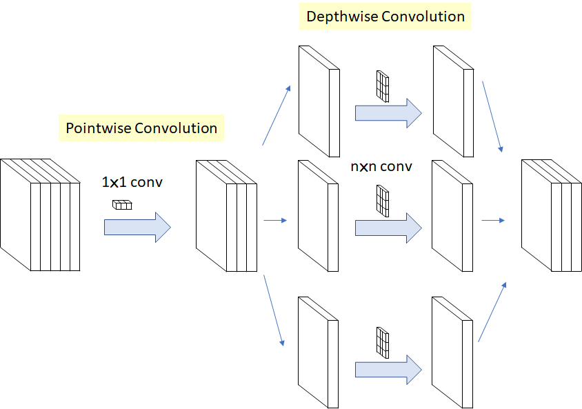
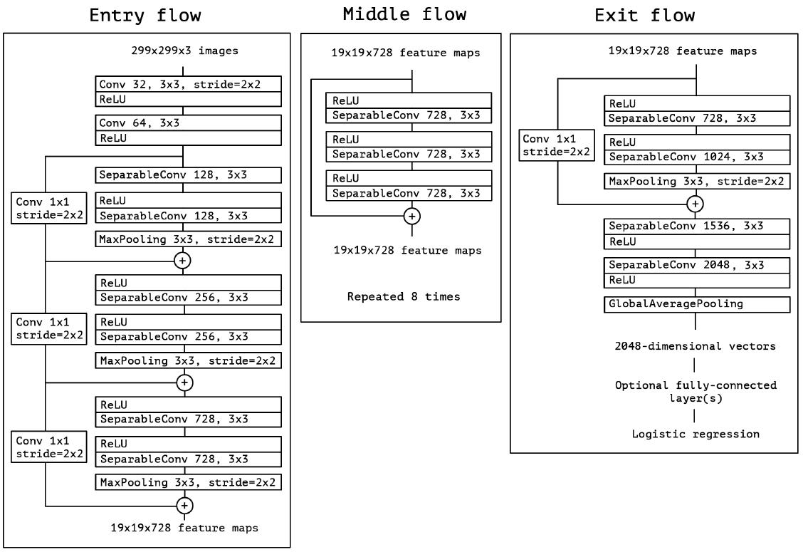
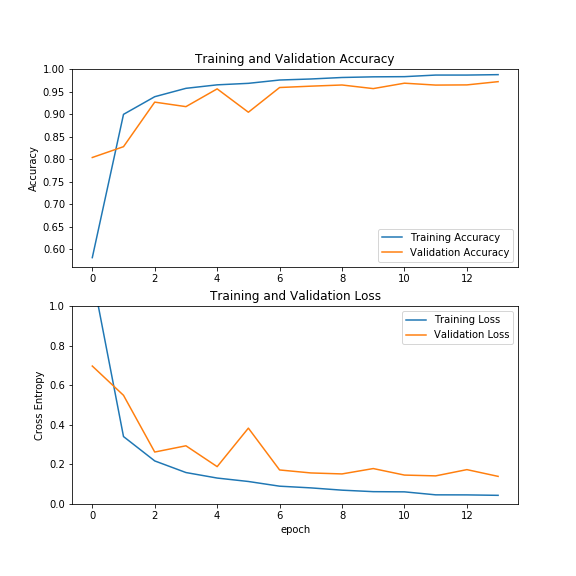
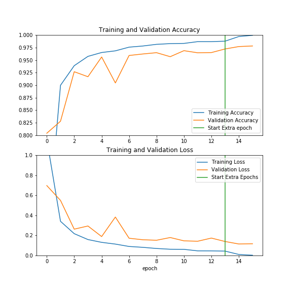

# Modified MNIST, State-of-the-art exploration

Nothing is better suited for the task of image classification than the usage of neural network architectures that involve CNNs. The 2D-topological nature of pixels and high-dimensionality in images  (i.e. (height,weight,colour channels)), make CNNs the most suitable and popular choice to build architectures~\cite{lec_15}. In this case, rather than the classical MNIST dataset, we had the opportunity to work with the Modified MNIST dataset, in which each image had three randomly placed handwritten digits, and the goal was to identify the biggest one. Placing our foundations on the idea of transfer learning, we built on state-of-the art models such as ResnetV2 , VGG, Xception and InceptionV3, which we trained on the freely available Google Colab's Tesla K80 GPU\cite{colabGPU}. In the end, we quickly realized that trained by training the whole network architectures from scratch yielded the best results. Hyperparameter tuning  was a crucial part of the process, as we could observe how final accuracy, variability and convergence speed significantly changes based on different hyperparameter choices. In particular, a Dropout rate of 0.6 was the most adequate in our case. Perhaps not surprisingly, the usage of these architectures were able to learn significant feature parameters and performed quite well on such modified dataset. In the end, among the multiple models we tried, the Xception model yielded a local validation accuracy of **97.60%** as well as a test accuracy of **97.83%** on the Kaggle Competition, trained with Dropout=0.6 on 14 initial epochs with a batch size of 32, followed by two additional "boosting" epochs with increased batch sizes of 128 and 256, respectively. 

## Our paper: 
- https://drive.google.com/file/d/1U83h-mp98gqcPfC3Ixjb2D_T7xa-Og0r/view?usp=sharing

## Reproducibility 

- With some basic effort, our models should be easily reproducible with the help of Google Colab. For this purpose, we suggest you upload the training datasets first to the Google drive and then link it. For instnace, below is the link to the notebook with which you can follow our steps the Modified MNIST classification challenge using the **Xception** model: 

https://colab.research.google.com/drive/15nqNJPDeNn21UOdF0AVtOTNdfjDVOxIv 

- **Note:** The training an testing images dataset, as well as the training labels all together can be obtained from https://www.kaggle.com/c/modified-mnist/data 
- Similar notebooks are can be found under the *best_models* directory. 

## Models

During this project, we tried various state-of-the-art models described below, available through the `keras.applications` module of `Tensorflow`: 

  - Xception 
  - VGG16 
  - InceptionV3
  - InceptionResNetV2	 
  - Resnet50v2
  - Resnet151v2
  - DenseNet201
  - NASNetLarge
  - ResNet152V2

We adapted, in each case, the top layer achitecture to our problem, and hypertuned parameters.The repo contains a folder named **best-models**, which contains our trained model notebooks and metrics for the best hyperparameter configurations for each model. See the paper for more details. 

## Best Performing model: 
- **Xception, no pre-trained parameters, 14+2 epochs, Dropout 0.6, val_acc = 97.82%, Kaggle acc: 97.60**

The Xception model architecture is as follows: 

- A closer look to one of the Inception Resent modules: 

Employing this model, we obtained the following metrics: 

### Train and validation loss and accuracy for the 14 training epochs 

### Final train and validation loss and accuracy after the last two training epochs 

 Modified_MNIST_state-of-the-art_exploration by Hair Parra, Tommy Luo and Logan Ralston is licensed under a <a rel="license" href="http://creativecommons.org/licenses/by-nc-sa/4.0/">Creative Commons Attribution-NonCommercial-ShareAlike 4.0 International License</a>.

  

